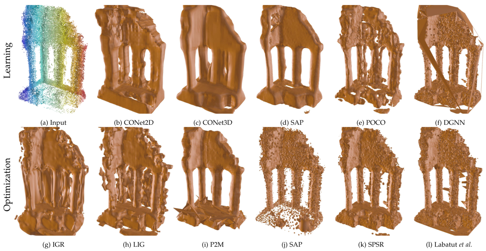

# A Survey and Benchmark of Automatic Surface Reconstruction from Point Clouds

Data and evaluation code for the paper **A Survey and Benchmark of Automatic Surface Reconstruction from Point Clouds** ([arXiv](https://arxiv.org/abs/2301.13656)).




## :floppy_disk: Datasets

### Berget *et al*.

- The watertight meshes and scanned point clouds used in our paper can be downloaded [here](https://drive.google.com/file/d/18usEYyY0A1KqbVdbwu7QDA2rH-UNRdsj/view?usp=sharing).


### ModelNet10

- The watertight ModelNet10 models can be downloaded [here on Zenodo](https://zenodo.org/record/5920479#.YflZilvMLIE).
- The scanned point clouds used in our paper can be downloaded
[here on Zenodo](https://zenodo.org/record/5940164#.YflZolvMLIE). The dataset also includes evaluation data and training
data for ConvONet, Points2Surf, Shape As Points, POCO and DGNN.

### ShapeNet*v1* (13 class subset of [Choy *et al*.](https://arxiv.org/abs/1604.00449))

- The watertight ShapeNet models can be downloaded [here](https://s3.eu-central-1.amazonaws.com/avg-projects/occupancy_networks/data/watertight.zip) (provided by the authors of [ONet](https://arxiv.org/abs/1812.03828)).
- To produce the scanned point clouds used in our paper follow the instructions below.
- Training and evaluation data for ShapeNet can be downloaded [here](https://s3.eu-central-1.amazonaws.com/avg-projects/occupancy_networks/data/dataset_small_v1.1.zip) (provided by the authors of [ONet](https://arxiv.org/abs/1812.03828)).


## :chart_with_upwards_trend: Evaluate your surface reconstruction method

1) Clone and install this repository with
```bash
git clone https://github.com/raphaelsulzer/dsr-benchmark.git
cd dsr-benchmark
bash install.sh   # create a conda environment called dsr including all python dependencies
conda activate dsr
```
2) Clone and install [mesh-tools](https://github.com/raphaelsulzer/mesh-tools) to your `CPP_DIR`.

3) Download and unzip the three datasets above (Berger, ModelNet, ShapeNet) to your `DATASET_DIR`.

4) Test if everything is installed correctly by running.

```bash
python test/test_benchmark.py --cpp_dir CPP_DIR --dataset_dir DATASET_DIR
```

5) Apply your reconstruction algorithm and evaluate your reconstructions.

```python
from dsrb.datasets import Berger, ModelNet10, ShapeNet
from dsrb.eval import MeshEvaluator

me = MeshEvaluator()

####################################################
### Berger et al. dataset (Experiments 4, 6 & 7) ###
####################################################
dataset = Berger()
# get the MVS scans used in Experiment 4 (learning-based)
models = dataset.get_models(scan_configuration="mvs")
# or, get the LiDAR scans used in Experiment 6 (optimization-based)
models = dataset.get_models(scan_configuration=["0","1","2","3","4"])
for model in models:
    input_data = model["scan"]
    YOUR_RECONSTRUCTION_ALGORITHM(
        points=input_data["points"],
        normals=input_data["normals"], # optional
        sensor_position=input_data["sensor_position"], # optional
        # # or, if your algorithm inputs a .ply file with points and normals
        # infile=model["scan_ply"],
        outfile=model["output"]["surface"].format("NAME_OF_YOUR_ALGORITHM"))
# evaluate your reconstructions 
me.eval(models,outpath=dataset.path,method="NAME_OF_YOUR_ALGORITHM")

###############################################
### ModelNet10 dataset (Experiments 3 & 5 ) ###
###############################################
dataset = ModelNet10()
models = dataset.get_models()
models_train = models["train"]
for model in models["test"]:
    input_data = model["scan"]
    YOUR_RECONSTRUCTION_ALGORITHM(
        points=input_data["points"],
        normals=input_data["normals"], # optional
        sensor_position=input_data["sensor_position"], # optional
        outfile=model["output"]["surface"].format("NAME_OF_YOUR_ALGORITHM"))
# evaluate your reconstructions
me.eval(models,outpath=dataset.path,method="NAME_OF_YOUR_ALGORITHM")

############################################
### ShapeNet dataset (Experiments 1 - 5) ###
############################################
dataset = ShapeNet()
dataset.setup()
# the scanned point clouds for ShapeNet are not included in the downloaded dataset
# generate the 10k scans with outliers and noise (Experiment 2) 
models = dataset.get_models(splits="test")
dataset.scan(scan_configuration="6") # takes around 4h
# generate the 3k scans with noise
dataset.clear()
models = dataset.get_models()
dataset.scan(scan_configuration="4") # takes around 4h
# now get either scan 4 (3k noise) or scan 6 (10k noise and outliers)
dataset.clear()
models = dataset.get_models(scan_configuration="4")
models_train = models["train"]
models_validation = models["val"]
for model in models["test"]:
    input_data = model["scan"]
    YOUR_RECONSTRUCTION_ALGORITHM(
        points=input_data["points"],
        normals=input_data["normals"], # optional
        sensor_position=input_data["sensor_position"], # optional
        outfile=model["output"]["surface"].format("NAME_OF_YOUR_ALGORITHM"))
# evaluate your reconstructions
me.eval(models,outpath=dataset.path,method="NAME_OF_YOUR_ALGORITHM")
```


## :book: Citation

If you find the code or data in this repository useful, please consider citing

```bibtex
@misc{sulzer2023dsr,
  doi = {10.48550/ARXIV.2301.13656},
  url = {https://arxiv.org/abs/2301.13656},
  author = {Sulzer, Raphael and Landrieu, Loic and Marlet, Renaud and Vallet, Bruno},
  keywords = {Computer Vision and Pattern Recognition (cs.CV), Computational Geometry (cs.CG), FOS: Computer and information sciences, FOS: Computer and information sciences},
  title = {A Survey and Benchmark of Automatic Surface Reconstruction from Point Clouds},
  publisher = {arXiv},
  year = {2023},
}
```